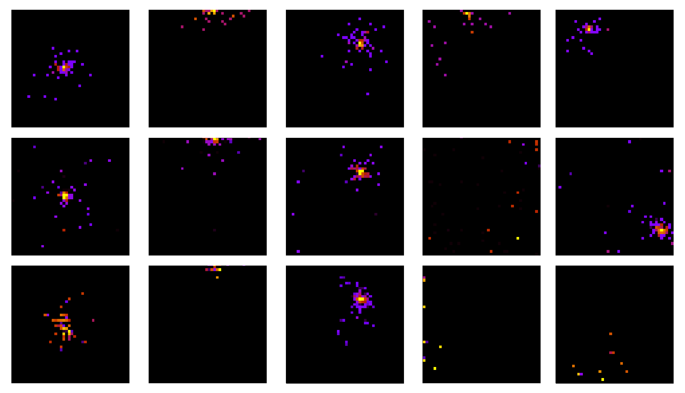

# Even Faster Simulations with Flow Matching: A Study of Zero Degree Calorimeter Responses

## Overview

This repository provides the implementation of our fast simulation framework for Zero Degree Calorimeters (ZDCs) in the ALICE experiment at CERN. 
It leverages recent advances in generative neural networks, particularly flow matching (FM), to generate high-fidelity detector responses with significantly reduced inference time.
Our models achieve state-of-the-art simulation quality for both neutron (ZN) and proton (ZP) detectors, while offering orders of magnitude faster inference compared to existing Monte Carlo simulators.



*Example simulated responses of the ZN detector. From top to bottom: GEANT simulation, FM, latent FM.*

## Applied Methods

We implement and benchmark a range of generative modeling techniques tailored for fast ZDC simulation:

* **Flow matching:**
  * Low-parameter models (approx. 70k) trained using flow-matching loss.
  * Achieves high sample fidelity (Wasserstein distance of 1.27 for the ZN simulation and 1.30 for the ZP simulation) with fast sampling times (∼0.46 ms/sample).
* **Latent flow matching:**
  * FM model applied in the latent space of a variational autoencoder (VAE).
  * Offers further reduction in inference time to ∼0.026 ms/sample.
* **VQ-GAN:**
  * Vector quantization of detector responses followed by generative modeling with GPT prior.
* **Classical ML:**
  * MLPs, decision trees, SVMs, and gradient boosting models as baselines for direct channel prediction.

## Repository Structure

The project is organized as follows:

```
├── models/                        # Standalone inference modules and pretrained weights
│   ├── flow_matching/             # FM models (ONNX + weights)
│   ├── latent_flow_matching/      # Latent FM models (ONNX + weights)
│   └── vq_gan/                    # VQ-GAN (weights)
│
├── zdc/                           # Source code and model implementations
│   ├── architectures/             # Encoder-decoder backbones (Conv, UNet, Transformers)
│   ├── layers/                    # Custom neural network layers
│   ├── models/                    # Generative models (FM, VAE, VQ-GAN, classical ML)
│   ├── scripts/                   # Tuning scripts
│   └── utils/                     # Utilities for training, evaluation, and losses
│
├── pyproject.toml                 # Dependency specification
```

## Requirements

The repository was tested on an NVIDIA A100 with 40 GB memory. Ensure that your hardware setup includes a GPU with 
sufficient memory capacity for running the training and inference effectively. Additionally, make sure to install the 
specified versions of required libraries. All dependencies are listed in pyproject.toml file.

## Citation

If you find this repository useful in your work, please cite the corresponding paper:

```latex
@misc{wojnar2025fast,
      title={Even Faster Simulations with Flow Matching: A Study of Zero Degree Calorimeter Responses}, 
      author={Maksymilian Wojnar},
      year={2025},
      eprint={2507.18811},
      archivePrefix={arXiv},
      primaryClass={cs.LG},
      url={https://arxiv.org/abs/2507.18811}, 
}
```
